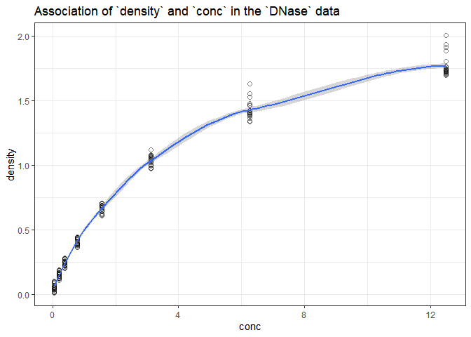

431 Lab 01
================
Due **2020-09-07** at 9 PM. Last Edited 2020-08-24 22:40:21

Lab 01 is divided into 4 parts, all of which you need to complete by the
deadline above.

# Part 1. Make a 30-second video to help us pronounce your name and learn something interesting about you

In this activity, you will create and submit a short (30 seconds or
less, please) video of yourself (recording yourself using Zoom is a
solid approach.) In this film, we should be able to see your face
clearly and also hear you clearly, so make sure that is the case. The
resulting video should ideally be sent to us as an **.mp4** file.

## You will be doing two things in the video:

1.  First, say hello, and then state your name, loudly and clearly, so
    that the viewer can learn to pronounce it correctly. Please use both
    your given name and your family name. If you prefer to be called by
    a nickname, please specify that, too.

2.  Then, tell us something about you that we don’t know, and might be
    interested to learn. It can be anything at all. We’re hoping to get
    to know you a little better, and this can be something about your
    professional or private life, or whatever you feel you would like to
    share with us. We’re hoping to facilitate connections here.

### Some tips for the video…

  - Expect that your fellow students (as well as the Teaching Assistants
    and Dr. Love) will see your video before the semester is over, so
    keep that in mind as you decide what to tell us.
  - Do not worry about the quality of the video, or adding elaborate
    theatricality, props or scenery. If you’d like to do so, that’s
    fine, but just make sure that we can see you and hear what you are
    saying clearly.
  - We’re not kidding about the 30-second time limit. Please don’t let
    your video exceed 30 seconds.

# Part 2. Interpret a Visualization Built in R

Professor Love used R and the `tidyverse` to build the plot below using
the `DNase` data set from the `datasets` package automatically loaded by
R.

``` r
ggplot(DNase, aes(x = conc, y = density)) +
    geom_point(pch = 1, size = 2, alpha = 0.5) +
    geom_smooth(method = "loess") +
    labs(title = "Association of `density` and `conc` in the `DNase` data") +
    theme_bw()
```

    `geom_smooth()` using formula 'y ~ x'

<!-- -->

Use the Help window in R to learn about the `DNase` data set, and in
particular, about the two variables displayed in the plot and their
scientific context. Then write a paragraph (no more than 100 words)
which explains what the plot indicates about the relationship between
the two variables, and (more generally) what you have learned about the
data (or science) from the plot. If you cannot use R to learn about the
data for some reason, try
<https://www.rdocumentation.org/packages/datasets/versions/3.6.1/topics/DNase>.

# Part 3. React to the Introduction of *The Art of Statistics*

Read the introduction to David Spiegelhalter’s book *The Art of
Statistics*. Then write a short essay (of 100-150 words, please)
describing how the PPDAC problem solving cycle might be helpful to you
in the context of ome “problem” you are interested in solving. Please
feel free to draw on your own experience solving problems in a
systematic way, and don’t feel obliged to write about a “problem” that
is related to biology or medicine or health or science. Anything you can
explain briefly and that you are interested in could work well here.

# Part 4. Complete a Survey via a Google Form

Please complete the survey provided at
<http://bit.ly/431-2020-lab01-survey>.

You’ll need to log into Google using your CWRU ID in order to access the
form. The survey asks about your attitudes toward statistics, as well as
for your opinion about the most important things you learned in the
first few sessions of 431. It should take less than 10 minutes for you
to complete the form.

# Submitting the Lab

Eventually, you will:

  - create an `.mp4` video file for part 1
  - build a single Word or PDF or HTML document containing your
    responses to parts 2 and 3 (please include your full name in the
    body of the document and make it clear which response is for part 2,
    and which is for part 3.)
  - complete (and submit) the Google Form for part 4

The essays and the video should be submitted (the system will let you
upload each file) to the Lab 01 section in the [Assignments folder in
Canvas](http://canvas.case.edu) by the deadline.

# Grading

We will summarize some of the more interesting responses to these parts
after the Lab has been graded.

  - This Lab will be graded on a scale from 0-100, and students will
    receive 25 points for successful completion of each of the four
    parts of the Lab.
  - Note that the teaching assistants will review Parts 2 and 3
    carefully to assess clarity of writing, attention to detail, and
    adherence to grammatical and syntax requirements, but we will not
    grade Lab 01 with those elements in mind. (Spelling, grammar, syntax
    and the rest will start to matter for grading purposes in Lab 02.)
